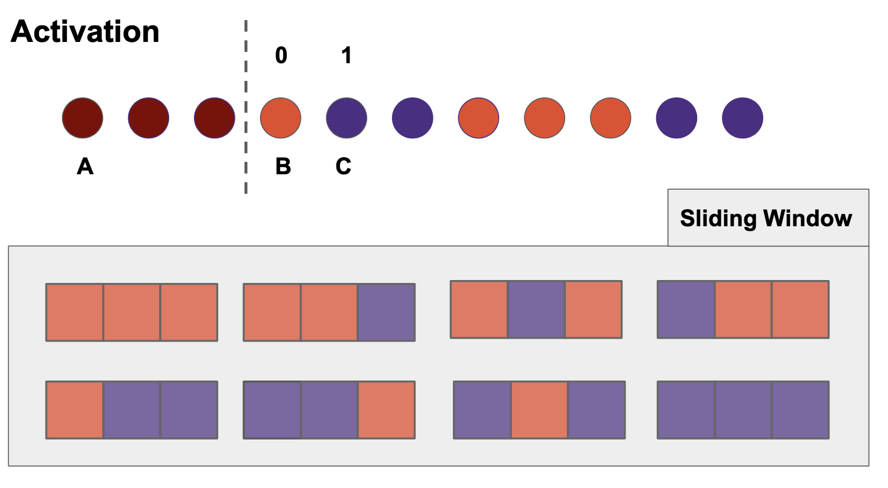
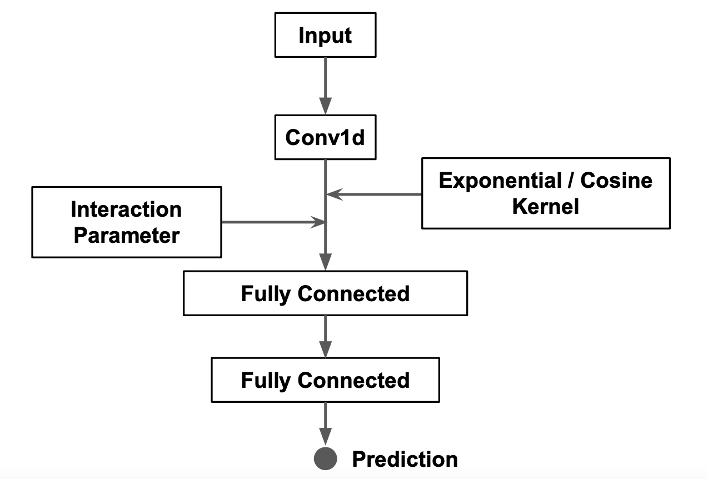
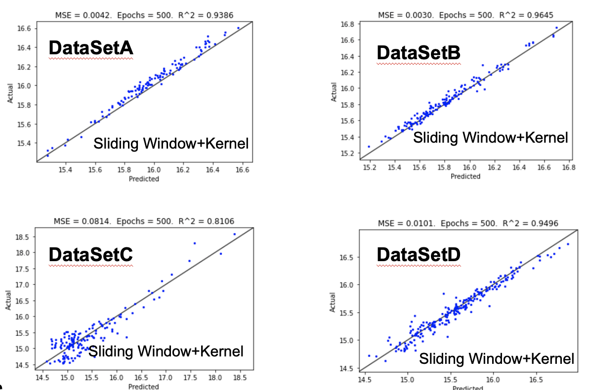

# Multi-channel PolyConvNet
1D convolutional neural net for predicting the lamellar period of copolymers based on sequence of beads. 

### Team Borides
Members: Kastan Day, Aria Coraor, Seonghwan Kim, Jiahui Yang, Ruijie Zhu

### Slides
https://docs.google.com/presentation/d/1Mo8zei8vpj9Wm4sYGLbQqZcCSg4fV2Ck/edit#slide=id.p7

## ***Directories***
```
.
├── data                                             # input data file for feature generation
├── Sliding_window_feature_generation.ipynb          # code used to generate multi-channel sliding window features
├── features                                         # folder containing all the features used to train the neural net
├── Multi-channel PolyConvNet.ipynb                  # code used to train / test the Multi-channel PolyConvNet
├── models                                           # folder containing the trained models
├── LICENSE
└── README.md
```

## ***ML Features***

***1. Sliding window features***

29-dimensional feature used to capture the activation of polymer sequence


***2. Kernels***
- Exponential kernel: 30-dimensional feature used to capture the interaction at two ends
- Cosine kernel: 15-dimensional feature used to capture the periodicity of sequence

***3. VAE features***

4-dimensional feature generated using the Variational Autoencoder model

***4. Interaction parameter***

## ***Multi-channel PolyConvNet***

The model consists of a series of convolution layer and fully connected layers that extract patterns from the polymer sequence.



## ***Model Performance***


## ***Computational Efficiency***
|           Feature Generation          |  Time (min) |
| ------------------------------------- | ----------- |
| Sliding Window Features (2 channels)  |      0.5    |
| Kernel Features                       |     0.08    |
| VAE Features                          |       30    |

|      Model Training/Validation        |  Time (min) |
| ------------------------------------- | ----------- |
| Training                              |        1    |
| Validation                            |     0.02    |
* All runtimes reported using Theta GPU
